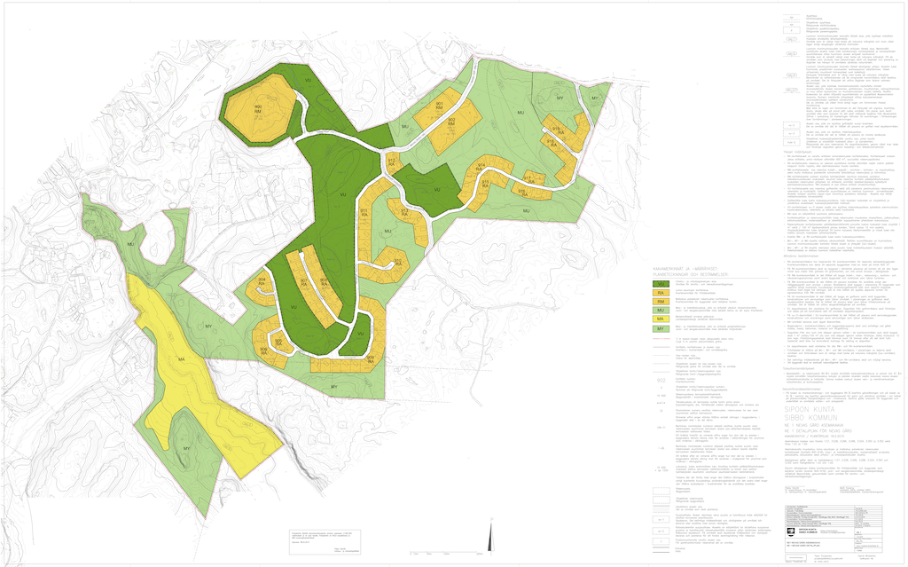

# Testiaineistot

[Yleis- ja asemakaavan tietomallit -projektissa](../../../projektit/ak-yk-tietomallit/) laadittiin 
[loogisen tason Kaavatietomallin](/kaavatiedot/v1.0/looginenmalli/dokumentaatio/) mukainen [PostgreSQL-tietokanta](../postgre/) ja [demopalvelu](../demo/) [Kaava-JSON](../json/)-formaatissa olevien kaavojen testaamiseksi. Testauksessa tuotettiin kaavoista kaavan ulkoraja, kaavakohteet ja kaavamääräykset (sekä ulkorajaan että kaavakohteisiin liittyvät), ks. [Testauksen kuvaus](../../../projektit/ak-yk-tietomallit/testaus/).

Kaikki geometriat muutettiin käytännön syistä WGS84-koordinaatistoon, sillä alkuperäisten koordinaatistojen geometrioiden käsittely olisi ollut testauksen tavoitteisiin nähden liian työlästä sekä tietoja digitoitaessa että palveltaessa tietoja OGC API Features -rajapintapalvelun kautta. Kaava-JSON -formaatti ei rajoita koordinaatistojen käyttöä, mutta on hyvä tietää, että GeoJSON-spesifikaation ([IETF RFC 7946](https://www.rfc-editor.org/info/rfc7946)) mukaan GeoJSON-kohteiden koordinaatisto on aina WGS84 (urn:ogc:def:crs:OGC::CRS84), longitudi, latitudi -järjestyksessä. Tuottajien ja käyttäjien yhteisellä ennakkosopimuksella tästä  voidaan spesifikaation mukaan kuitenkin poiketa.

Huomaa, että testiaineston koodistoviittaukset eivät vastaa [Yleis- ja asemakaavan tietomallit -projektin](../../../projektit/ak-yk-tietomallit/) lopullisia koodistoja, sillä ne pohjaustuvat testauksen aikaisiin versioihin koodistoista ja niiden sisältämistä koodeista. Myös tietoranteissa voi esiintyä pieniä eroja lopulliseen [Kaava-JSON](../json/)-formaattiin verrattuna samasta syystä.

Testiainestot ovat saatavilla [projektin demopalvelussa](../demo/) 31.3.2021 saakka.

## Ensimmäinen asemakaava, Sipoo Nevas gård (NE 1)

([suurempi kuva](./ne1_nevas_gard_kaavakartta_hyvaksytty.png))

[Alkuperäiset aineistot](https://github.com/YM-rakennettu-ymparisto/kaavatietomalli/tree/master/testaus/alkuperaiset-aineistot/Sipoo) (DWG)

Mallinnetut elinkaaritilat [Kaava-JSON](../json/)-muodossa:

* [Virelletullut](https://github.com/YM-rakennettu-ymparisto/kaavatietomalli/blob/master/testaus/json-testiaineisto/OGR-AK_SIPOO_1_vireilletulo_kaava-sipoo-nevasgard.geojson)
* [Kaavaehdotus](https://github.com/YM-rakennettu-ymparisto/kaavatietomalli/blob/master/testaus/json-testiaineisto/OGR-AK_SIPOO_2_kaavaehdotus_kaava-sipoo-nevasgard.geojson)
* [Tarkistettu kaavaehdotus](https://github.com/YM-rakennettu-ymparisto/kaavatietomalli/blob/master/testaus/json-testiaineisto/OGR-AK_SIPOO_3_tarkistettu_kaavaehdotus_kaava-sipoo-nevasgard.geojson)
* [Hyväksytty kaava](https://github.com/YM-rakennettu-ymparisto/kaavatietomalli/blob/master/testaus/json-testiaineisto/OGR-AK_SIPOO_4_hyvaksytty_kaava_kaava-sipoo-nevasgard.geojson)
* [Lainvoimainen kaava](https://github.com/YM-rakennettu-ymparisto/kaavatietomalli/blob/master/testaus/json-testiaineisto/OGR-AK_SIPOO_5_lainvoimainen_kaava-sipoo-nevasgard.geojson)

## Strateginen yleiskaava, Tampere Kantakaupungin yleiskaava 2040, Hervannan alue

([suurempi kuva](./Yk2040_Kartat_1-4_voimaantulo_20_1_2020.png))

[Alkuperäiset aineistot](https://github.com/YM-rakennettu-ymparisto/kaavatietomalli/tree/master/testaus/alkuperaiset-aineistot/Tampere) (Shapefile)

Mallinnetut elinkaaritilat [Kaava-JSON](../json/)-muodossa: [Lainvoimainen kaava](https://github.com/YM-rakennettu-ymparisto/kaavatietomalli/blob/master/testaus/json-testiaineisto/OGR-YK_TAMPERE_HERVANTA_1_lainvoimainen_kaava-hervanta.geojson)

## Vaiheasemakaava, Espoo Servinniemi (VK2001)

([suurempi kuva](./VK2001_pdfA.png))

[Alkuperäiset aineistot](https://github.com/YM-rakennettu-ymparisto/kaavatietomalli/tree/master/testaus/alkuperaiset-aineistot/Espoo) (DWG, MapInfo)

Mallinnetut elinkaaritilat [Kaava-JSON](../json/)-muodossa: [Lainvoimainen kaava](https://github.com/YM-rakennettu-ymparisto/kaavatietomalli/blob/master/testaus/json-testiaineisto/OGR-AK_ESPOO_uusi_kaava.geojson)

Vanha kaava, jota vaihekaava muuttaa: [Lainvoimainen kaava](https://github.com/YM-rakennettu-ymparisto/kaavatietomalli/blob/master/testaus/json-testiaineisto/OGR-AK_ESPOO_vanha_kaava.geojson)

## Rakentamista ohjaava yleiskaava, Lahti Enonsaari (Y-165)

([suurempi kuva](./Y-165.png))

[Alkuperäiset aineistot](https://github.com/YM-rakennettu-ymparisto/kaavatietomalli/tree/master/testaus/alkuperaiset-aineistot/Lahti) (ShapeFile)

Mallinnetut elinkaaritilat [Kaava-JSON](../json/)-muodossa: [Lainvoimainen kaava](https://github.com/YM-rakennettu-ymparisto/kaavatietomalli/blob/master/testaus/json-testiaineisto/OGR-YM_LAHTI_Enonsaari_1_lainvoimainen_kaava-enonsaari.geojson)

