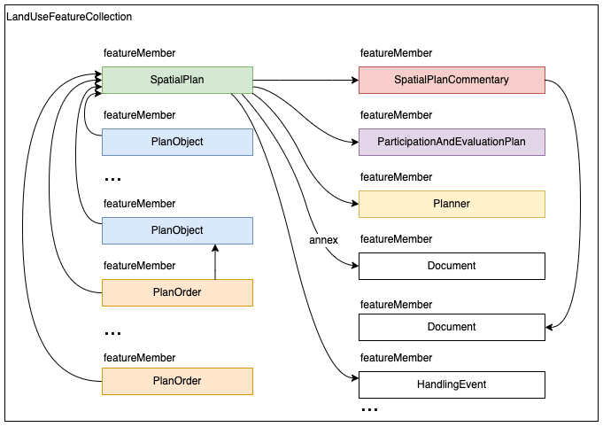

# KAATIOn kaava-XML -esimerkkejä

## KAATIOn tiedonsiirtoformaatti

KAATIO-hankkeessa tuotetaan tietomallipohjaisia kaavoja perustuen [Kaavatietomallin versioon 1.1](https://tietomallit.ymparisto.fi/kaavatiedot/v1.1/) pohjautuvaan GML-sovellusskeemaan, joka on kuvattu [XML-skeemana](../). GML-sovellusskeema mahdollistaa edelleen hyvin erilaisten XML-tiedostojen tuottamisen kaavalle, joten KAATIOssa on tarpeen edelleen tarkentaa tuottettavan XML-siirtotiedoston rakennetta.

Periaatteena on, että kaikki skeeman GML-kohteet (feature) kootaan yhteisen juurielementin (LandUseFeatureCollection) alle ja sekä assosiaatiot että viittaukset koodistojen arvoihin toteutetaan käyttäen xlink:href -linkkejä.


Näin saadaan aikaan tiedonsiirtopaketti, johon sisältyvät kaikki yhden kaavan XML-elementit, ja joka ei ole kohtuuttoman syvästi hierarkinen. Koska kaikki feature-tyyppisten elementtien keskinäiset assosiaatiot toteutetaan tunnuspohjaisilla linkeillä, on tunnusten hallintaan ja käyttöön syytä kiinnittää erityistä huomiota.

Lisätietoja 23.8.2022 pidetyn elinkaarisääntöjen sparraustilaisuuden materiaalista:
* [Interaktiivinen Miro-taulu](https://miro.com/app/board/uXjVPdDbppg=/?share_link_id=967230847193)

## Tallennustiedostot
Esimerkkejä kaavanlaadintasovelluksella laadittavasta, tallennuspalveluun vietävästä XML-muotoisesta kaavasta, joissa ei vielä ole pysyviä kohdekohtaisia tunnuksia.

* [spatialPlan-collection-simple.xml](./spatialPlan-collection-simple.xml): Sipoon Nevas gård:n asemakaavan perusteella laadittu esimerkki, jossa vain yksi yleismääräys, yksi kaavakohde ja ko. kaavakohteeseen liitetty kaavamääräys. (spatialplan-skeeman versio 1.2)

## Kaavatietovarannosta haettavat aineistot
Esimerkkejä XML-kaava-aineistoista, joita tallennuspalvelu palauttaa, ja joissa pysyvät tunnukset on täydennetty ja niitä käyttävät keskinäiset linkit päivitetty. 

### Ensimmäisen tallennuksen palauttama tiedosto

* [spatialPlan-collection-simple-1st-save-with-ids.xml](./spatialPlan-collection-simple-1st-save-with-ids.xml): Sipoon Nevas gård:n asemakaavan perusteella laadittu esimerkki, jossa vain yksi yleismääräys, yksi kaavakohde ja ko. kaavakohteeseen liitetty kaavamääräys. (spatialplan-skeeman versio 1.2). Ylemmän esimerkin ```spatialPlan-collection-simple.xml```, mutta se kaavatietovaraston lisäämät tunnukset ja keskinäiset viittaukset päivitetty. 

### Myöhemmän kaavan version tallennuksen palauttama tiedosto

* [spatialPlan-collection-simple-2nd-save-with-ids.xml](./spatialPlan-collection-simple-2nd-save-with-ids.xml): Sipoon Nevas gård:n asemakaavan perusteella laadittu esimerkki, jossa vain yksi yleismääräys, yksi kaavakohde ja ko. kaavakohteeseen liitetty kaavamääräys. (spatialplan-skeeman versio 1.2). Ylemmän esimerkin ```spatialPlan-collection-simple-1st-save-with-ids.xml```, mutta se kaavatietovaraston muokkaamat tunnukset ja keskinäiset viittaukset päivitetty. 


